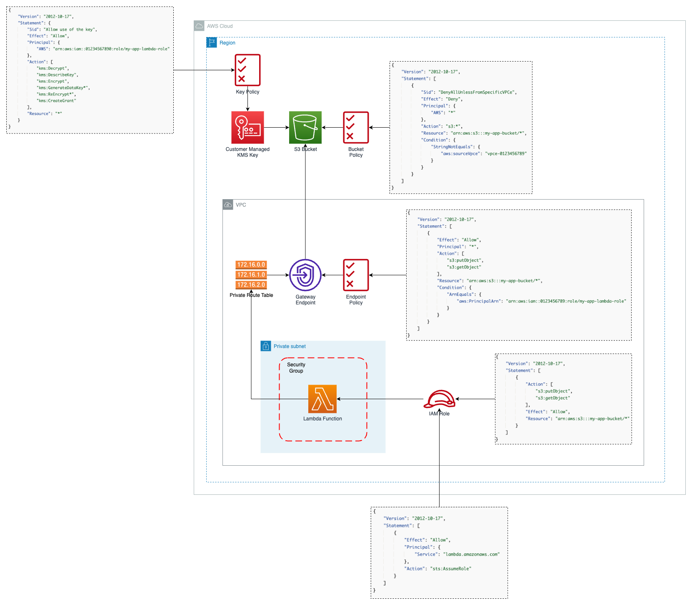

# S3 security hardening for private VPCs using Terraform

## Target architecture

This is a fully functional example of how to secure an S3 bucket in a private VPC using Terraform. For a full walkthrough, please find the associated blog post here: https://www.skripted.io/blog/s3-security-hardening-for-private-vpcs-using-terraform

## Author

For questions, comments or improvements, please contact:

- Maxim Schram [max@skripted.io](mailto:max@skripted.io)
